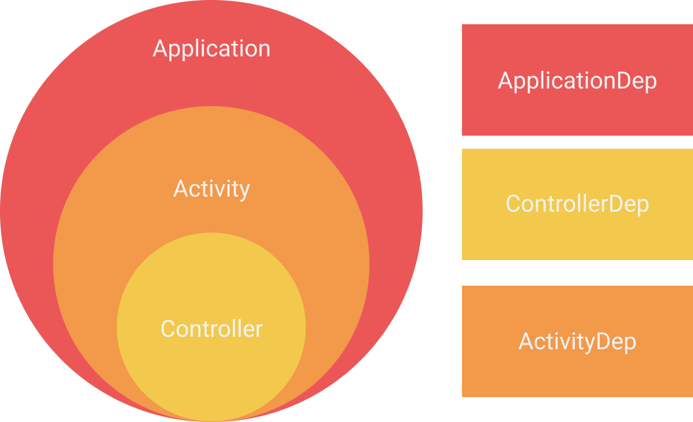

# Conductor Dagger
Some helper classes that will allow you to inject your Conductor Controllers with Dagger.
This is a fork of https://github.com/Bodo1981/conductor-dagger.

I wanted to experimented with it some more.

## Goal
I added a fake dependency on each level of the app.  
Scopes in the app include

> Application -> Activity -> Controller

</img>

And the related dependencies:  
> ApplicationDep, ActivityDep and ControllerDep

In this sample I want to showcase these possibilities:
* The Controller should have access to all of them
* The Activity to the ActivityDep and ApplicationDep
* And the Application solely to the ApplicationDep
